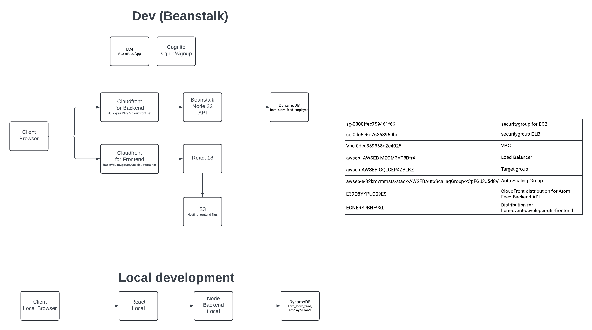

# Atomfeed

99% of code was created with Cursor (Sonnet 3.7)

A modern full-stack application for managing HCM Atom Feed Records, consisting of a React frontend and Node.js Express backend.

## Project Overview

Atomfeed helps manage and track HCM (Human Capital Management) atom feed records with an intuitive UI and robust backend services. The application interacts with a DynamoDB table to store and retrieve record data.

The application uses different DynamoDB tables based on the environment:
- `hcm_atom_feed_employee_local` - Used when running the app on a local machine
- `hcm_atom_feed_employee` - Used with the app deployed on AWS Elastic Beanstalk

The application's architecture leverages several AWS services:
- Frontend: React application hosted on S3 and served through a CloudFront distribution
- Backend: Express.js API deployed to Elastic Beanstalk with a separate CloudFront distribution for caching and global access
- Database: DynamoDB tables for scalable, managed NoSQL storage
- Authentication: AWS Cognito for secure user management

## Architecture Diagram




## Features

### Frontend
- Secure authentication with AWS Cognito (sign-up, sign-in, verification)
- Dark/light mode toggle with responsive Tailwind CSS design
- Record management (create, view, search, delete)
- Batch delete functionality for multiple records
- Pagination for browsing large datasets
- Environment-based configuration system

### Backend
- RESTful API built with Express.js
- DynamoDB integration using AWS SDK v3
- JWT-based authentication with AWS Cognito
- Swagger UI for API documentation
- Input validation with Joi
- CORS support for secure cross-origin requests
- Configurable Winston logging with environment-based levels

## Getting Started

### Prerequisites
- Node.js (v22+)
- AWS account with:
  - DynamoDB access
  - Cognito User Pool
  - Elastic Beanstalk service for backend deployment
  - S3 for frontend storage
  - CloudFront distributions (one for frontend hosting, one for backend API)
  - Appropriate IAM permissions

### Development Tools Setup
For local development, you'll need to install and configure the following tools:

#### Node.js and npm
We recommend using Node Version Manager (nvm) to manage Node.js versions:

##### macOS (using Homebrew)
```bash
# Install Homebrew if not already installed
/bin/bash -c "$(curl -fsSL https://raw.githubusercontent.com/Homebrew/install/HEAD/install.sh)"

# Install nvm using Homebrew
brew install nvm

# Create NVM directory
mkdir ~/.nvm

# Add NVM configuration to your profile (~/.zshrc or ~/.bash_profile)
echo 'export NVM_DIR="$HOME/.nvm"' >> ~/.zshrc
echo '[ -s "/usr/local/opt/nvm/nvm.sh" ] && . "/usr/local/opt/nvm/nvm.sh"' >> ~/.zshrc
echo '[ -s "/usr/local/opt/nvm/etc/bash_completion.d/nvm" ] && . "/usr/local/opt/nvm/etc/bash_completion.d/nvm"' >> ~/.zshrc

# Source your profile to apply changes
source ~/.zshrc

# Install Node.js v22
nvm install 22
nvm use 22

# Verify installation
node --version  # Should show v22.x.x
npm --version   # Should show 10.x.x
```

For Windows, you can use [nvm-windows](https://github.com/coreybutler/nvm-windows) or install Node.js v22 directly from the [official website](https://nodejs.org/).

#### AWS CLI

##### macOS (using Homebrew)
```bash
# Install AWS CLI
brew install awscli

# Verify installation
aws --version

# Configure AWS CLI
aws configure
# Enter your AWS Access Key ID, Secret Access Key, region (eu-north-1), and output format
```

For Windows, download and run the installer from the [AWS CLI website](https://aws.amazon.com/cli/).

#### Elastic Beanstalk CLI

##### macOS (using Homebrew)
```bash
# Install Python (prerequisite for EB CLI)
brew install python

# Install EB CLI using pip
pip3 install awsebcli

# Verify installation
eb --version

# Initialize EB CLI in your project directory
cd Atomfeed/backend
eb init
# Follow the prompts to select your region and application
```

For Windows, you can install the EB CLI using pip:
```bash
# Install EB CLI using pip
pip install awsebcli

# Verify installation
eb --version
```

## Backend

### Setup
1. Navigate to the backend directory:
   ```
   cd Atomfeed/backend
   ```
2. Install dependencies:
   ```
   npm install
   ```
3. Configure environment variables in `.env`:
   ```
   AWS_REGION=your_aws_region
   AWS_ACCESS_KEY_ID=your_access_key_id
   AWS_SECRET_ACCESS_KEY=your_secret_access_key
   PORT=5000
   TABLE_NAME=hcm_atom_feed_local  # Use hcm_atom_feed_local for local development
   NODE_ENV=local
   LOG_LEVEL=debug
   COGNITO_USER_POOL_ID=your_user_pool_id
   COGNITO_APP_CLIENT_ID=your_app_client_id
   DISABLE_AUTH=false  # Set to true in development to bypass auth
   ```

### Running the Backend

#### Development Mode
```
cd backend
npm run local  # Uses nodemon for auto-restart on changes
```

#### Production Mode
```
cd backend
npm start
```

### Running with Docker

#### Using Docker Compose (Recommended)

The easiest way to run both frontend and backend together is using Docker Compose:

```bash
# From the root directory
docker-compose up

# To run in detached mode (background)
docker-compose up -d

# To rebuild containers after changes
docker-compose up --build

# To stop the containers
docker-compose down
```

This will:
- Start both frontend and backend containers
- Set up the network between them
- Mount AWS credentials correctly
- Configure all environment variables
- Make the services available at:
  - Frontend: http://localhost:3000
  - Backend: http://localhost:5000
  - Backend API Docs: http://localhost:5000/api-docs

**Note:** Docker Compose requires AWS credentials to be properly configured in your local `~/.aws/credentials` file.

#### Backend Docker Setup
The backend includes a Dockerfile optimized for production use. You can build and run the backend in a Docker container with the following commands:

```bash
# Navigate to the backend directory
cd backend

# Build the Docker image
docker build -t atomfeed-backend .

# Run the container with AWS credentials mounted
docker run --name backend -p 5000:5000 \
  -v ~/.aws:/home/node/.aws:ro \
  atomfeed-backend
```

**Important Notes for Docker Setup:**
- AWS credentials must be properly configured in your local `~/.aws/credentials` file
- The `-v ~/.aws:/home/node/.aws:ro` flag mounts your AWS credentials into the container in read-only mode
- For Windows, use: `-v %USERPROFILE%\.aws:/home/node/.aws:ro` (Command Prompt) or `-v $env:USERPROFILE\.aws:/home/node/.aws:ro` (PowerShell)
- The backend container exposes port 5000 by default

#### Frontend Docker Setup
The frontend includes a Dockerfile optimized for production use. You can build and run the frontend in a Docker container:

```bash
# Navigate to the frontend directory
cd frontend

# Build the Docker image
docker build -t atomfeed-frontend .

# Run the container
docker run --name frontend -p 3000:80 atomfeed-frontend
```

**Environment Configuration for Docker:**
You can pass environment variables to customize the container behavior:

```bash
# For backend with specific environment settings
docker run --name backend -p 5000:5000 \
  -v ~/.aws:/home/node/.aws:ro \
  -e NODE_ENV=production \
  -e LOG_LEVEL=info \
  atomfeed-backend

# For frontend with API URL configuration
docker run --name frontend -p 3000:80 \
  -e REACT_APP_API_URL=https://d3uoqraz1379l5.cloudfront.net \
  -e REACT_APP_ENVIRONMENT=production \
  atomfeed-frontend
```

### Backend Deployment to Elastic Beanstalk
The backend can be deployed to AWS Elastic Beanstalk using the provided script:
```
cd backend
./deploy-to-beanstalk.sh
```

When deployed, the Swagger UI will be available at:
```
http://hcmeventdeveloperutil.eba-rwxupczj.eu-north-1.elasticbeanstalk.com/api-docs
```

#### Backend CloudFront Distribution
The backend API is also accessible through a CloudFront distribution that serves as a cache and content delivery network for the API:

```
https://d3uoqraz1379l5.cloudfront.net
```

This CloudFront distribution is referenced in the frontend configuration as `API_CLOUDFRONT_URL` and provides improved performance and caching for API requests.

### Elastic Beanstalk Environment Variables
The deployed backend on Elastic Beanstalk uses the following environment variables:

```
API_CLOUDFRONT_URL=https://d3uoqraz1379l5.cloudfront.net
AWS_ACCESS_KEY_ID=[REDACTED]
AWS_REGION=eu-north-1
AWS_SECRET_ACCESS_KEY=[REDACTED]
COGNITO_APP_CLIENT_ID=43mpnnsk8cb79gs4gjkgii52j9
COGNITO_REGION=eu-north-1
COGNITO_USER_POOL_ID=eu-north-1_vyUcMe53b
NODE_ENV=dev
PORT=5000
TABLE_NAME=hcm_atom_feed
```

> **⚠️ IMPORTANT:** The actual AWS credentials (Access Key ID and Secret Access Key) have been redacted from this README for security reasons. Never commit or share AWS credentials in code repositories or public documentation. The actual values are configured securely in the Elastic Beanstalk environment.

These environment variables are configured in the Elastic Beanstalk environment configuration.

### API Documentation

#### Swagger UI Access
When the backend is running, access the Swagger UI documentation at:
```
http://localhost:5000/api-docs
```

#### Swagger UI Authentication
The Swagger UI is protected with authentication. When visiting the `/api-docs` endpoint, you'll have two options:

1. **Login with Cognito Credentials**: If you have a username and password for the Cognito User Pool.
2. **Provide a JWT Token**: If you already have a valid JWT token.

In development mode, if `DISABLE_AUTH=true` is set in your `.env` file, authentication will be bypassed.

#### Main API Endpoints

- `POST /api/records` - Create a new record
- `GET /api/records` - List records with pagination
- `DELETE /api/records/:constantKey/:feed` - Delete a single record by ID
- `DELETE /api/records` - Batch delete multiple records
- `GET /api/records/search` - Search records by PersonId

### Logging Configuration

The backend uses Winston for logging with the following configuration:

- **local** environment: Default log level is `debug` (shows all log messages)
- **dev** environment: Default log level is `info` (shows info, warn, and error messages)
- Other environments: Default log level is `info`

Override the default log level by setting the `LOG_LEVEL` environment variable:
```
LOG_LEVEL=debug|info|warn|error
```

The application provides API endpoints to view and change the log level at runtime:
```
GET /api/admin/log-level - Get the current log level
POST /api/admin/log-level - Change the log level (requires authentication)
```

### DynamoDB Table Structure

The application interacts with DynamoDB tables with the following attributes:

- `Constant_Key` (string) - Primary key
- `Feed` (string) - Sort key
- `PersonId` (string) - Additional attribute used for searching

Tables are environment-specific:
- `hcm_atom_feed_local` - For local development
- `hcm_atom_feed` - For the AWS Elastic Beanstalk deployed application

Make sure to update the `TABLE_NAME` environment variable accordingly for your environment.

## Frontend

### Setup
1. Navigate to the frontend directory:
   ```
   cd Atomfeed/frontend
   ```
2. Install dependencies:
   ```
   npm install
   ```
3. Configure environment variables in `.env`:
   ```
   REACT_APP_ENVIRONMENT=local
   REACT_APP_API_URL=http://localhost:5000
   REACT_APP_COGNITO_REGION=your_cognito_region
   REACT_APP_COGNITO_USER_POOL_ID=your_user_pool_id
   REACT_APP_COGNITO_APP_CLIENT_ID=your_app_client_id
   ```

### Running the Frontend

#### Development Mode
```
cd frontend
npm start
```

#### Production Mode
```
cd frontend
npm run build
```

### Frontend Deployment to S3/CloudFront
The frontend can be deployed to AWS S3/CloudFront using the provided script:
```
cd frontend
./deploy-frontend.sh
```

#### Frontend CloudFront Distribution
The frontend is hosted through a dedicated CloudFront distribution that serves the React application globally:

```
# CloudFront distribution information is stored in
frontend/cloudfront-info.txt
```

The CloudFront distribution provides:
- Global content delivery with low latency
- HTTPS security
- Edge caching for improved performance
- Custom domain support

The deployment script automatically updates the S3 bucket and invalidates the CloudFront cache when new code is deployed.

## Authentication Flow

1. Users sign up with an email and password
2. A verification code is sent to the email
3. After verification, users can sign in
4. JWT tokens are used for API authentication
5. Tokens are automatically refreshed when needed

## Project Structure

```
Atomfeed/
├── backend/
│   ├── src/
│   │   ├── auth/           # Authentication utilities
│   │   ├── config/         # App configuration
│   │   ├── controllers/    # API request handlers
│   │   ├── middleware/     # Express middleware
│   │   ├── models/         # Data models
│   │   ├── routes/         # API route definitions
│   │   ├── utils/          # Utility functions
│   │   ├── swagger/        # API documentation
│   │   └── index.js        # Application entry point
│   ├── .ebextensions/      # Elastic Beanstalk configuration
│   ├── .elasticbeanstalk/  # EB environment settings
│   └── deploy-to-beanstalk.sh # Deployment script
│
├── frontend/
│   ├── public/             # Static assets
│   ├── src/
│   │   ├── components/     # React components
│   │   ├── contexts/       # React contexts
│   │   ├── hooks/          # Custom hooks
│   │   ├── pages/          # Page components
│   │   ├── services/       # API services
│   │   ├── utils/          # Utility functions
│   │   └── App.js          # Main application component
│   └── deploy-frontend.sh  # S3/CloudFront deployment script
└── README.md              # This file
```

## Troubleshooting

### Authentication Issues
- If you see "Unauthorized: No token provided" after signing in, try refreshing the page
- The application includes retry logic to handle token initialization timing issues
- Ensure Cognito User Pool settings match the application configuration

### Configuration Loading
- Verify all environment variables are correctly set
- The frontend supports different configuration methods based on environment:
  - `local`: Uses .env file variables
  - `dev`: Loads config.json from CloudFront
  - Other environments: Uses environment variables with fallbacks

### AWS Setup
- Ensure your AWS credentials have the appropriate permissions
- For local development, proper AWS configuration in ~/.aws/ or via environment variables is required
- The EB CLI requires proper setup for deployments

## Contributing

1. Always test code locally before deploying
2. Follow the established code patterns in the repository
3. Maintain separation between frontend and backend concerns